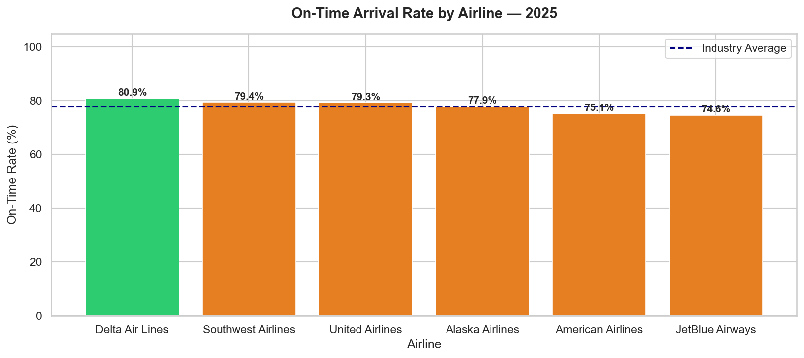
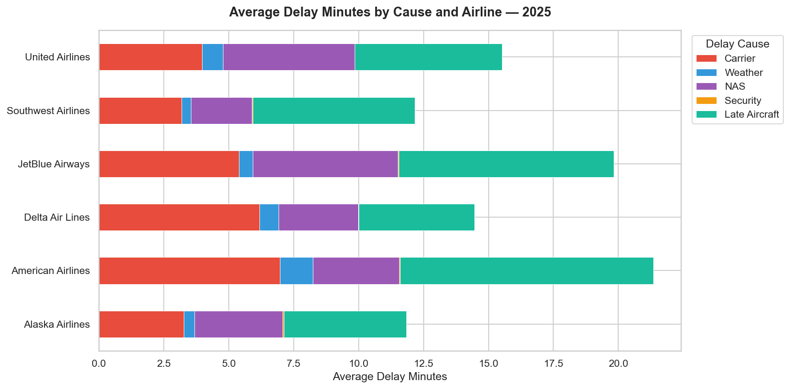
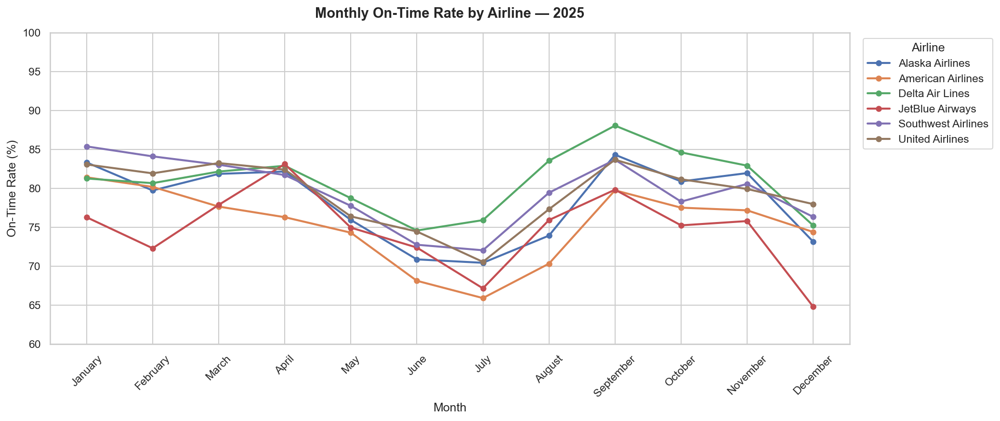

# ✈️ Flight Delay & Airline Performance Analysis — 2025

> An end-to-end data analytics pipeline analyzing **5.2 million U.S. commercial flights** using official government data — the same dataset used by the FAA and Department of Transportation to measure airline performance.

## 🔗 Live Dashboard
**[View Interactive 3-Page Tableau Dashboard →](https://public.tableau.com/app/profile/nilkanth.patel4075/viz/FlightDelayAnalysis2025/1-ExecutiveOverview)**

---

## 📌 Business Question

Which U.S. airlines, routes, and airports have the worst delay performance in 2025, and what operational factors — carrier issues, weather, NAS, or late aircraft — are driving the most disruption?

---

## 🔍 Key Findings

| # | Finding |
|---|---------|
| 1 | **Industry on-time rate: 78.5%** across all 6 major carriers in 2025 |
| 2 | **JetBlue Airways ranked last** with only 74.62% on-time arrivals — 6.24 pts below Delta |
| 3 | **Late Aircraft cascading delays** were the #1 cause at **41.2%** of all delayed flights — not weather |
| 4 | **July was the worst month** at 71.11% on-time — summer travel demand overwhelms capacity |
| 5 | **DFW was the worst departure airport** averaging 23.7 minutes late per departure |
| 6 | **Sunday is the worst day to fly** — only 74.11% on-time vs. Tuesday's best at 82.55% |
| 7 | **Short-haul routes (&lt;500mi) outperform long-haul** — 81.51% vs 75.60% on ultra-long routes |
| 8 | **Weather delays averaged 115 mins** when they occurred — the highest severity of any cause |

---

## 📊 Dashboard Preview

### Dashboard 1 — Executive Overview


### Dashboard 2 — Delay Analysis


### Dashboard 3 — Route & Airport Intelligence


---

## 🗄️ Data Sources

| Source | Description | Scale |
|--------|-------------|-------|
| [Bureau of Transportation Statistics (BTS)](https://transtats.bts.gov) | Official U.S. airline on-time performance — mandatory government reporting | 5.2M+ flights |
| [AviationStack API](https://aviationstack.com) | Real-time flight status, airline & airport reference data | Live |
| [OpenSky Network API](https://opensky-network.org) | Open-source aircraft tracking from ADS-B receivers worldwide | Live |

**Airlines covered:** United Airlines · Delta Air Lines · American Airlines · Southwest Airlines · Alaska Airlines · JetBlue Airways

> ⭐ **Recruiter note:** The BTS dataset is the same data the FAA, DOT, and airlines use internally to measure and report performance. Using it signals you know where real industry data comes from.

---

## 🛠️ Tech Stack

| Tool | Purpose |
|------|---------|
| Python + Pandas | Data ingestion and cleaning|
| SQLAlchemy + psycopg2 | Python-to-PostgreSQL connection layer |
| Matplotlib + Seaborn | 6 static exploratory visualizations |
| Requests + python-dotenv | API calls to AviationStack and OpenSky |
| Plotly | Interactive delay cause chart with hover/zoom |
| PostgreSQL | Relational database — normalized schema across 4 tables |
| SQL | 8 KPI queries — window functions, CTEs, multi-table JOINs |
| Tableau | 3-page operational dashboard with navigation |
| Git + GitHub | Version control and portfolio hosting |

---

## 📈 Airline Performance Summary

| Airline | Total Flights | On-Time Rate | Avg Arrival Delay | Avg Dep Delay |
|---------|--------------|-------------|-------------------|---------------|
| Delta Air Lines | 1,015,218 | **80.86%** ✅ | 5.68 mins | 11.58 mins |
| Southwest Airlines | 1,380,086 | 79.42% | 6.03 mins | 12.81 mins |
| United Airlines | 788,744 | 79.29% | 7.29 mins | 12.21 mins |
| Alaska Airlines | 242,614 | 77.89% | 4.79 mins | 8.20 mins |
| American Airlines | 955,974 | 75.08% | 13.65 mins | 18.95 mins |
| JetBlue Airways | 227,588 | **74.62%** ❌ | 10.91 mins | 16.50 mins |

---

## 📁 Project Structure

```
flight-delay-analysis/
├── notebooks/
│   ├── 01_api_data_pull.ipynb        # AviationStack + OpenSky API pulls
│   ├── 02_data_cleaning.ipynb        # BTS data cleaning + feature engineering
│   ├── 03_load_to_postgresql.ipynb   # Load cleaned data into PostgreSQL
│   └── 04_eda_analysis.ipynb         # 7 Python visualizations
├── sql/
│   ├── schema.sql                    # 4-table normalized database schema
│   └── kpi_queries.sql               # 8 KPI queries (window functions, CTEs)
├── data/
│   ├── raw/                          # Original BTS download + API pulls
│   ├── cleaned/                      # Cleaned flight + cancellation CSVs
│   └── exports/                      # SQL query results for Tableau
├── visuals/                          # Exported charts (PNG + HTML)
├── tableau/                          # Tableau workbook
├── .env.example                      # API key template (never commit .env)
├── requirements.txt                  # Python dependencies
└── README.md
```

---

## 🚀 How to Run

### 1. Clone the repository
```bash
git clone https://github.com/YOUR_USERNAME/flight-delay-analysis.git
cd flight-delay-analysis
```

### 2. Set up your Python environment
```bash
python3 -m venv venv
source venv/bin/activate
pip3 install -r requirements.txt
```

### 3. Configure your API keys
```bash
cp .env.example .env
```
Open `.env` and add your AviationStack API key:
```
AVIATIONSTACK_KEY=your_api_key_here
```
Get a free key at [aviationstack.com](https://aviationstack.com) — no credit card required.

### 4. Download the BTS dataset
1. Go to [transtats.bts.gov/DL_SelectFields.aspx](https://transtats.bts.gov/DL_SelectFields.aspx)
2. Select **Year: 2025**, **All Months**
3. Check these fields: `FlightDate`, `Reporting_Airline`, `Origin`, `Dest`, `DepDelay`, `ArrDelay`, `Cancelled`, `CancellationCode`, `CarrierDelay`, `WeatherDelay`, `NASDelay`, `SecurityDelay`, `LateAircraftDelay`, `AirTime`, `Distance`
4. Download and save to:
```bash
data/raw/bts_flights_2025.csv
```

### 5. Set up PostgreSQL
```bash
brew install postgresql@16
brew services start postgresql@16
psql postgres -c "ALTER USER postgres PASSWORD 'postgres123';"
```

### 6. Run the notebooks in order
```
01_api_data_pull.ipynb       → pulls airline + airport reference data
02_data_cleaning.ipynb       → cleans 5.2M rows, creates business metrics
03_load_to_postgresql.ipynb  → loads data into PostgreSQL
04_eda_analysis.ipynb        → generates all 7 visualizations
```

### 7. Run the SQL schema and queries
```bash
# In DBeaver or psql — run in this order:
sql/schema.sql       # creates tables
sql/kpi_queries.sql  # runs all 8 KPI queries
```

---

## 📜 License

This project uses publicly available government data from the Bureau of Transportation Statistics. All analysis and code is original work by Nilkanth Patel.

---

*Data Source: Bureau of Transportation Statistics (BTS), 2025 | Built by Nilkanth Patel*